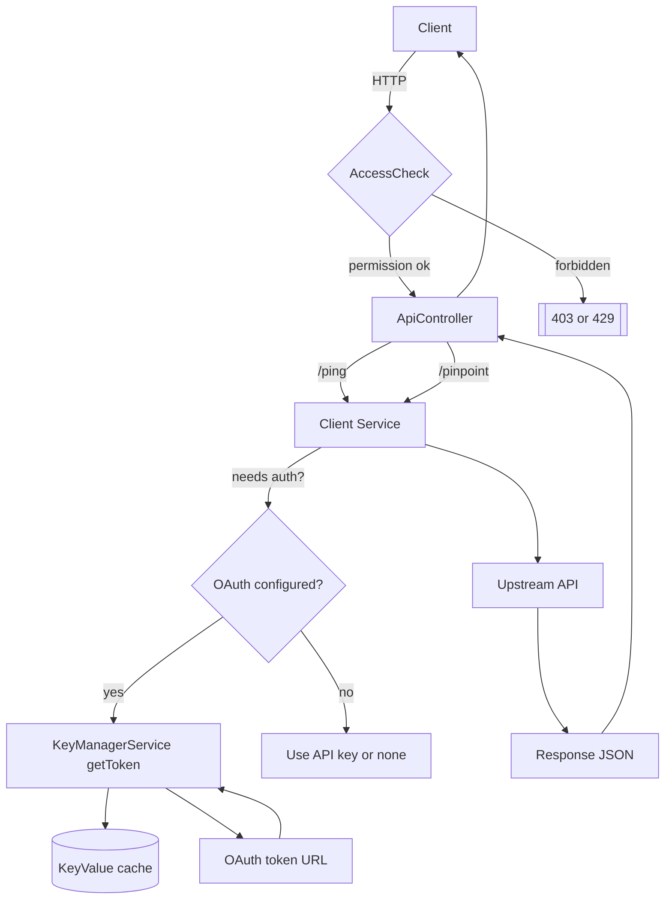

# LATAM API

A Drupal module that exposes JSON endpoints and centralizes per-country API settings. Countries are configurable. Supports API-Key or OAuth2 client_credentials with a built-in token cache. Includes permission gating, optional shared-secret header, and optional rate limiting.

## Features
- Configurable list of country codes.
- Per-country settings: base URL, API key, locale, OAuth token URL, client id/secret, scope, and a per-country `pinpoint` URL.
- Endpoints:
  - `GET /api/latam/ping?cc=XX` – returns active country config snapshot (non-sensitive fields).
  - `POST /api/latam/pinpoint?cc=XX` – forwards arbitrary JSON to the configured `pinpoint_url` with automatic Authorization.
- Access control via permission `access latam api` and optional header `X-LATAM-TOKEN`.
- Internal OAuth token manager caching tokens per (token URL + client id + scope).
- Optional IP rate limiting using Drupal’s flood system (disabled by default).

## Requirements
- Drupal 10 or 11
- PHP compatible with your Drupal core
- Drush recommended for install and cache clears

## Install
1. Copy the `latam_api/` folder to `modules/custom/`.
2. Enable and clear cache:
   ```bash
   drush en latam_api -y && drush cr
   ```
## File structure
```
drupal-plugin-api-latam/
└─ web/modules/custom/latam_api/                 ← existing module root (keep)
   ├─ latam_api.info.yml                          ← existing
   ├─ latam_api.routing.yml                       ← ADD: route for the IndiVideo host page
   ├─ latam_api.libraries.yml                     ← ADD: JS library definition for embed logic
   ├─ latam_api.services.yml                      ← (optional) only if we need services later; else omit
   ├─ README.md                                   ← UPDATE: usage docs for shortcode + host page
   ├─ config/
   │  ├─ schema/
   │  │  └─ latam_api.schema.yml                  ← UPDATE: add config keys for IndiVideo
   │  └─ install/                                 ← (no default config unless you want it pre-seeded)
   ├─ src/
   │  ├─ Controller/
   │  │  └─ IndiVideoController.php               ← ADD: renders the host page using config
   │  ├─ Form/
   │  │  └─ SettingsForm.php                      ← UPDATE: extend existing config form with video settings
   │  ├─ Plugin/
   │  │  └─ Filter/
   │  │     └─ IndiVideoFilter.php                ← ADD: shortcode filter for [individeo]
   │  └─ Validation/                              ← (optional) JSON validation helpers for vars
   ├─ templates/
   │  └─ latam-individeo-page.html.twig           ← ADD: host page template (theme-responsible styling)
   ├─ assets/
   │  └─ js/
   │     └─ individeo.embed.js                    ← ADD: vanilla JS for building iframe URL client-side
   └─ tests/                                      ← (empty for now; no tests as requested)

```

## Configure
`/admin/config/services/latam-api`

Global:
- Country codes: comma-separated list to control which country fieldsets are shown (for example `MX,CL,BR`).
- Security: optional header token gate (`X-LATAM-TOKEN`). If enabled, requests must include that header with the configured value.
- Rate limiting: optional per-route IP throttle (requests per minute).

Per country (each code you list):
- `base_url`
- `api_key` (used if OAuth is not configured)
- `locale`
- `oauth_token_url`, `oauth_client_id`, `oauth_client_secret`, `oauth_scope`
- `pinpoint_url` (target used by the `POST /api/latam/pinpoint` endpoint)

Auth priority: OAuth (if all OAuth fields are present) → API key → none.


## Permissions
- `access latam api` – required to hit the endpoints.
- Admin UI is behind standard configuration permissions and the module’s settings route.

## Endpoints

### Ping
```
GET /api/latam/ping?cc=XX
```

Response:
```json
{
  "ok": true,
  "country": "MX",
  "base_url": "https://api.example.mx",
  "locale": "es_MX",
  "auth_mode": "oauth",
  "timestamp": "2025-09-23T00:00:00+00:00"
}
```

### Pinpoint
```
POST /api/latam/pinpoint?cc=XX
Content-Type: application/json
```

Example:
```bash
curl -X POST 'https://your-site.test/api/latam/pinpoint?cc=MX'   -H 'Content-Type: application/json'   -d '{"email":"a@b.com","perfil":"x","invInicial":1,"invMensual":1,"plazo":12,"NumContrato":"123","fondo":"foo","clave":"bar"}'
```

## Services
- `latam_api.client` – wrapper around Guzzle that chooses Authorization based on country config.
- `latam_api.key_manager` – internal token cache for OAuth client_credentials, TTL ≈ 13 minutes.

## Rate limiting
- If enabled, uses Drupal’s `flood` service to limit requests per IP per route.
- Default is disabled.

## Error handling
- 400 – invalid JSON body or missing parameters
- 403 – permission denied or missing header token
- 429 – too many requests if rate limiting enabled
- 500 – configuration or upstream error

## Logging
- Module logs to the `latam_api` channel.
- OAuth errors include response body when possible.

## Extending
- Add routes in `latam_api.routing.yml` and controllers in `src/Controller`.
- Use `latam_api.client` for consistent upstream requests.

## Mermaid diagram

